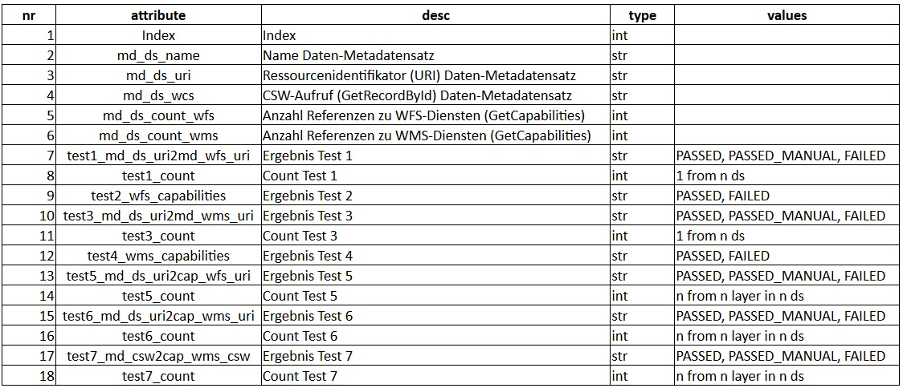

#

Simple INSPIRE Linkages Checker
===============================

## Inhalt
* [Einleitung](#einleitung)
* [Initialer POST-Request](#initialer-post-request)
* [Linkages-Checker in Python](#linkages-checker-in-python)
* [Summary](#summary)


## Einleitung
Wir wollen uns nachfolgend mit der Daten-Dienste-Kopplung beschäftigen, die zur Erfüllung der INSPIRE Anforderungen zu gewährleisten ist. D.h. wir wollen prüfen, ob für alle inspire-identifizierten Metadatensätze eine Verbindung zu  ihren Diensten (WMS und WFS) vorhanden ist. Dazu gibt es auf dem INSPIRE Geoportal das [Resource linkages checker tool](https://inspire-geoportal.ec.europa.eu/linkagechecker.html), das sich allerdings nur mit sehr viel manuellem Aufwand einsetzen lässt.

Deshalb habe ich diesen einfachen Linkages-Checker erstellt, der alle vorgeschriebenen Verknüpfungen auf ihre korrekte Implementierung prüft. Bei der Festlegung der Testfälle, habe ich mich strikt an die GDI-DE Vorgaben gehalten, die in dieser [Präsentation](https://www.gdi-de.org/SharedDocs/Downloads/DE/GDI-DE/Vortraege/2018/INTERGEO%20_Expertengespraech_Daten_Dienste_Kopplung.pdf?__blob=publicationFile) recht anschaulich dargestellt sind (vgl. S. 6ff).


## Initialer POST-Request
Der gesamte Prozess startet mit einem POST-Request, den wir uns vorab im Firefox Add-on RESTClient ansehen. Dazu wählen wir im RESTClient die Methode *'POST'*, die URL *'https://metaver.de/csw? '*, setzen in den Headers den Namen *'Content -Type'* sowie den Attribute Value *'application/xml'*. Es folgt der nachfolgende Body und wir können den Request abschicken, mit dem wir nur Datasets mit dem Schlagwort *'inspireidentifiziert'* anfordern.
```
<?xml version="1.0" encoding="UTF-8"?>
    <csw:GetRecords xmlns:csw="http://www.opengis.net/cat/csw/2.0.2" xmlns:gmd="http://www.isotc211.org/2005/gmd" service="CSW" version="2.0.2" resultType="results" outputFormat="application/xml" outputSchema="http://www.isotc211.org/2005/gmd" iplug="/ingrid-group:ige-iplug-HH" elementSetName="full">
      <csw:Query typeNames="csw:Record">
        <csw:Constraint version="1.1.0">
          <ogc:Filter xmlns="http://www.opengis.net/cat/csw/2.0.2" xmlns:apiso="http://www.opengis.net/cat/csw/apiso/1.0" xmlns:dc="http://purl.org/dc/elements/1.1/" xmlns:dct="http://purl.org/dc/terms/" xmlns:gmd="http://www.isotc211.org/2005/gmd" xmlns:gml="http://www.opengis.net/gml" xmlns:ogc="http://www.opengis.net/ogc" xmlns:ows="http://www.opengis.net/ows" xmlns:xsd="http://www.w3.org/2001/XMLSchema" xmlns:xsi="http://www.w3.org/2001/XMLSchema-instance">
            <ogc:And>
              <ogc:PropertyIsEqualTo>
                <ogc:PropertyName>apiso:type</ogc:PropertyName>
                <ogc:Literal>dataset</ogc:Literal>
              </ogc:PropertyIsEqualTo>
              <ogc:PropertyIsLike escapeChar="\" singleChar="?" wildCard="*">
                <ogc:PropertyName>AnyText</ogc:PropertyName>
                <ogc:Literal>inspireidentifiziert</ogc:Literal>
              </ogc:PropertyIsLike>
              <ogc:PropertyIsLike escapeChar="\" singleChar="?" wildCard="*">
                <ogc:PropertyName>AnyText</ogc:PropertyName>
                <ogc:Literal>https://registry.gdi-de.org/id/de.hh</ogc:Literal>
              </ogc:PropertyIsLike>
            </ogc:And>
          </ogc:Filter>
        </csw:Constraint>
      </csw:Query>
    </csw:GetRecords>
```


## Linkages-Checker in Python
Den einfachen Linkages-Checker habe ich in Python realisiert. Das python-package 'csw' und ein Client sind im Ordner [src](src) zu finden.

Die grundsätzliche Struktur der Daten-Dienste-Kopplung ist Abb. 1 zu entnehmen. Ausgehend vom initialen POST-Request, werden für jeden Daten-Metadatensatz, die Capabilities-Dokumente der Dienste aufgerufen und nachfolgend die Dienste-Metadatensätze. Die dabei abzuarbeitenden Testfälle sind in Abb. 2 beschrieben.


Abb. 1: Daten-Dienste-Kopplung


Abb. 2: Testfälle

Einschränkend sei noch darauf hingewiesen, dass im Prozess nicht alle Eventualitäten abgefangen werden. Dies kann ggf. zu einem *'FAILED'* Ergebnis führen oder im Fall einer Exception, zu einem Eintrag *'ERROR BY Result:'* im Logfile. Nicht geprüft werden aktuell Daten-Metadatensätze, die weniger oder mehr als einen WFS und WMS besitzen. Die Testergebnisse werden in ein CSV-File geschrieben, dessen Struktur der Tabelle 1 zu entnehmen ist.


Tab. 1: Tabellenstruktur Testergebnisse


## Summary
Mit Hilfe dieses einfachen Werkzeuges, konnten wir uns recht schnell einen Überblick über den Zustand der Daten-Dienste-Kopplung verschaffen. Es ersetzt aber nicht die Validierung mit dem [INSPIRE ETF-Validator](http://inspire.ec.europa.eu/validator/). Das [Resource linkages checker tool](https://inspire-geoportal.ec.europa.eu/linkagechecker.html) dagegen, scheint mir für den praktischen Einsatz von geringem Nutzen. Es eignet sich allenfalls für stichprobenhafte Kontrollen.
